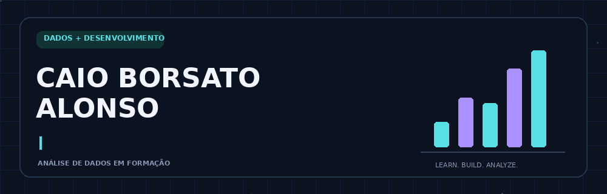

### 📊 Análise de Dados & Business Intelligence
**Base em desenvolvimento de sistemas · Python em aprendizado**

---

## 👨‍💻 Sobre mim

Sou **Caio Borsato Alonso**, estudante do último ano do **Ensino Médio Técnico em Desenvolvimento de Sistemas pelo SENAI**, direcionando minha carreira para **Análise de Dados e Business Intelligence**.

📊 Meu foco está em **Power BI, PostgreSQL e Excel**, aprofundando meus conhecimentos para explorar dados e comunicar informações com clareza.

🐍 Estou **começando em Python**, construindo a base para aplicá-lo ao tratamento e à análise de dados.

⚙️ Também tenho conhecimentos em **Java com Spring Boot e C#/.NET**, além de bancos de dados e APIs REST. Essa formação me ajuda a compreender como os sistemas geram, armazenam e disponibilizam dados.

🎯 Busco uma **oportunidade de estágio na área de Dados**, para aprender com profissionais e aplicar meus conhecimentos em desafios reais.

## 🛠️ Minha caixa de ferramentas

### Dados & Business Intelligence

### Desenvolvimento & APIs

### Aprendendo agora

---

## 🚀 Minha jornada em dados

| Foco | Próximos passos |
| :--- | :--- |
| 📊 **Power BI** | Aprofundar a criação de dashboards e a comunicação de indicadores. |
| 🗄️ **SQL e PostgreSQL** | Aprimorar consultas para explorar e analisar dados. |
| 📗 **Excel** | Evoluir na organização, no tratamento e na análise de informações. |
| 🐍 **Python** | Consolidar os fundamentos e avançar para aplicações em dados. |
| 🔎 **Projetos práticos** | Conectar perguntas de negócio à preparação, análise e visualização de dados. |

<!-- Adicione aqui os links de projetos reais quando estiverem prontos.
Para cada projeto, apresente: pergunta de negócio, ferramentas, imagem e principais conclusões.
-->

## 🐍 Minha atividade no GitHub

Um quadradinho de cada vez. Aprendizado contínuo, na prática.

## 🎓 Formação

**SENAI · Técnico em Desenvolvimento de Sistemas integrado ao Ensino Médio**  
Último ano · Conclusão prevista em **2026**.

Base em programação, bancos de dados, APIs e desenvolvimento de aplicações, complementada por estudos direcionados à área de dados.

📚 **Cisco Networking Academy:** trilha de conhecimentos em andamento.

---

### 🤝 Vamos nos conectar?

Aberto a **oportunidades de estágio** e à troca de conhecimentos sobre dados e desenvolvimento.

[**LinkedIn**](https://www.linkedin.com/in/caio-alonso-455358261/) &nbsp; · &nbsp; [**caioca827@gmail.com**](mailto:caioca827@gmail.com)

**Aprender com curiosidade. Construir com propósito. Analisar com clareza.**

